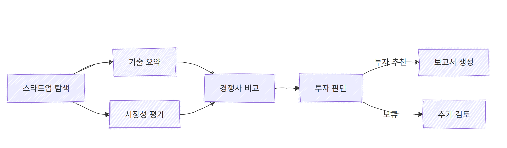
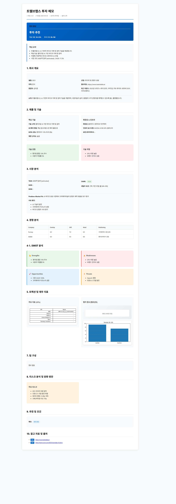

# 🚀 AI Startup Investment Evaluation Agent

> **시장·기술·경쟁 데이터를 실시간 수집·검증하고, SWOT·KPI 기반 분석으로 투자 시나리오를 자동 생성·판단하는 실증 중심 스타트업 평가 멀티 에이전트**

---

## 📌 Overview
- **Objective:** AI 스타트업의 기술력, 시장성, 리스크를 종합 분석하여 투자 적합성을 자동 평가  
- **Method:** LLM 기반 Agentic RAG 파이프라인  
- **Tools:** LangGraph · LangChain · Python

---

## 🔧 Features

* 📄 PDF 기반 정보 추출: IR 자료, 기사 등에서 자동 분석
* 🧠 투자 기준별 판단 분류: 시장성 · 팀 · 기술력 · 경쟁우위 · 실적 · 투자조건
* 📊 투자 종합 요약 생성: 투자 유망 / 조건부 투자 / 재검토 필요 자동 판단

---

## 🧱 Tech Stack

| Category  | Details                      |
| --------- | ---------------------------- |
| Framework | LangGraph, LangChain, Python |
| LLM       | GPT-4o-mini (OpenAI API)     |
| Retrieval | FAISS            |
| Embedding | BAAI/bge-base-en-v1.5               |

---
## 🏗️ Architecture



## 🤖 Agents (요약)

이 프로젝트는 AI 스타트업 투자 평가를 자동화하기 위해 **6개의 에이전트**로 구성됩니다:

- **🔍 스타트업 탐색 에이전트:** 웹/문서에서 스타트업 및 CEO 정보를 자동 수집·정제하고 벡터 DB를 구축하여 분석 기초 데이터를 확보  
- **🧠 기술 요약 에이전트:** 경쟁사·시장 데이터를 기반으로 핵심 기술 수준, IP, 성능, 확장성을 분석하고 정량·정성 요약을 생성  
- **📈 시장성 평가 에이전트:** TAM, CAGR, 수요 요인 등을 평가해 시장 규모·성장성·문제 적합성을 정량화  
- **🥊 경쟁사 비교 에이전트:** RAG 유사도 기반 주요 경쟁사 자동 검색 및 대체 솔루션을 자동 탐색하고 차별성·중복도·진입장벽을 평가  
- **🚀 투자 판단 에이전트:** 영역별 점수를 가중합하여 최종 투자 점수를 산출하고 투자 권고 / 조건부 / 재검토를 자동 결정  
- **📄 보고서 생성 에이전트:** 투자 판단이 ‘투자 권고’ 계열일 때 KPI, SWOT, 차별화 포인트를 HTML 템플릿에 매핑하고 PDF 투자 보고서를 자동 생성

➡️ [에이전트 상세 설명 보기](./docs/agents.md)


#### [참고] 📊 RAG 사용 위치

| 에이전트 | Retrieval | Vector DB | 
|---------|-----------|-----------|
| **Market** | Tavily + FAISS | `faiss_market_index` | 
| **Competitor** | FAISS + Tavily | `faiss_startup_index` | 


---

## 📊 투자 평가 개요

| 항목 | 비중 | 주요 요소 |
|------|------|-----------|
| 📈 시장성 | 35% | TAM, CAGR, Problem-fit |
| 🧠 기술력 | 25% | 성능, IP, 확장성 |
| 🥊 경쟁우위 | 20% | 차별성, Moat, 포지셔닝 |
| 💼 실적 | 10% | ARR, 파트너십, 펀딩 |
| 💰 투자조건 | 10% | 밸류에이션, 지분 구조 |

- **최종 점수 계산:** Final Score = Σ(영역 점수 × 가중치) – Risk Penalty

- **판단 기준:**  
  | 점수 | 판단 |
  |------|------|
  | ≥ 70 | ✅ 투자 권고 |
  | 60 ~ 69 | ⚠️ 조건부 투자 |
  | < 60 | ❌ 재검토 필요 |

투자 판단 결과가 ‘투자 권고’일 때만 보고서를 자동 생성하며, 분석된 KPI·SWOT·차별화 포인트를 HTML → PDF로 변환하여 결과를 제공합니다.

---

## 📂 Directory Structure

```
├── data/                  # 스타트업 PDF 문서
├── agents/                # 평가 기준별 Agent 모듈
├── prompts/              # 프롬프트 템플릿
├── outputs/              # 평가 결과 저장
├── app.py                # 실행 스크립트
└── README.md
```


---

<details>
  <summary><h3>🚀 보고서 예시 </h3></summary>


</details>


## 👥 Contributors

| 스타트업 탐색 에이전트                                                                                                             | 시장성 평가 에이전트                                                                                                             | 기술 요약 에이전트                                                                                                                 | 보고서 생성 에이전트                                                                                                            | 경쟁사 비교 에이전트                                                                                                            | 투자 판단 에이전트                                                                                                           |
| ------------------------------------------------------------------------------------------------------------------------ | ----------------------------------------------------------------------------------------------------------------------- | -------------------------------------------------------------------------------------------------------------------------- | ---------------------------------------------------------------------------------------------------------------------- | ---------------------------------------------------------------------------------------------------------------------- | -------------------------------------------------------------------------------------------------------------------- |
|  [곽윤철](https://github.com/YunCheol07) |  [김경수](https://github.com/gyeongsu01) |  [김형민](https://github.com/kimhmin0814) |  [송지수](https://github.com/sjisu7525) |  [최영욱](https://github.com/chxiowxxk) |  [조태환](https://github.com/gksl5355) |
 

---
